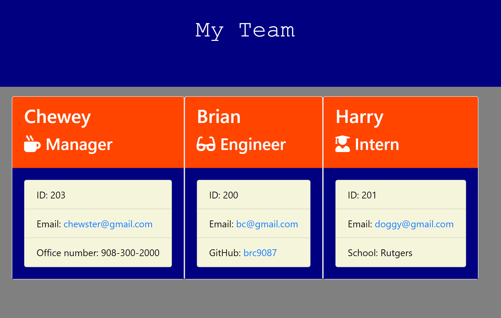

# Template Engine - Employee Summary

* As a manager
I want to generate a webpage that displays my team's basic info
so that I have quick access to emails and GitHub profiles

## Usage / Directions
* Click the link to organize myteam! ==> 

 

## MY TEAM PAGE
* 

 

## Home Page 
* 

 
    
    
## Search for Employee
*  

 

## Tools Used / Dependancies
--
* inquirer
* node.js
* JS
* testing
* Github

## Links
* https://brc9087.github.io/myapp/
* Repo: https://github.com/brc9087/TemplateEngineEmployee
